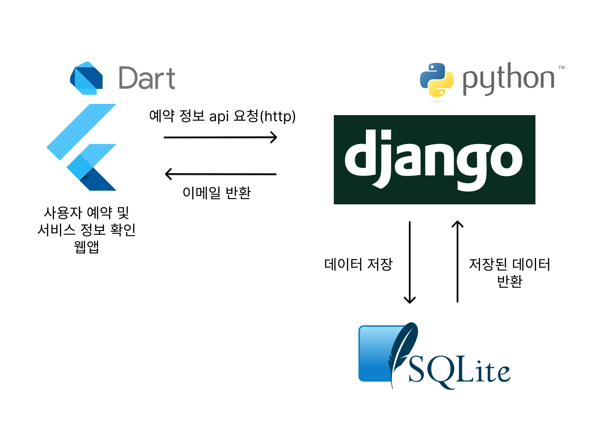

# [**2024 경주 지역문제 해결 해커톤 프로젝트**]

### 본 서비스는 2024 경주 지역문제 해결 해커톤 **팀 Null**의 프로젝트입니다.

---

## 팀원 소개

| **팀원 이름**          | **역할**                     |
|---------------------|--------------------------|
| 임채은                | 팀장(Leader), Frontend 개발  |
| 이수헌                | Backend 개발               |
| 김재윤                | Backend 개발               |

---

## 기술 스택

- **Frontend**  
    

- **Backend**  
      

- **DevOps**  
  

- **Communication**  
    

---

## 서비스 소개

### [**경주 관광 체험 앱**]
- 본 서비스는 경주의 관광지를 방문하며 사진 레이어를 수집하여 체험형 무드등(아크릴 및 나무 조립형)을 제작할 수 있는 프로그램입니다.
- 관광객은 앱을 통해 예약하고, 직접 체험을 통해 기념품을 만드실 수 있습니다.

---

## 주요 기능

- 관광 예약 기능 제공
- 경주의 주요 관광지에서 사진 레이어 수집
- 학교(동국대학교 WISE캠퍼스)에서 체험형 무드등 제작
- 사진 삽입 및 레이어 합성을 통한 개인화된 무드등 제공
- 제작된 무드등은 아크릴 및 나무 조립형 옵션 제공

---

## 서비스 아키텍처



---

## 🔄 Development Workflow

### 브랜치 전략

우리의 브랜치 전략은 Git Flow를 기반으로 하며, 다음과 같은 브랜치를 사용합니다.

- **Main Branch**:  
    - 배포 가능한 상태의 코드를 유지합니다.  
    - 모든 배포는 이 브랜치에서 이루어집니다.
- **Feature Branches**:  
    - 기능별로 브랜치를 분기합니다.  
    - 각 기능 개발은 `feature/{기능명}` 형식의 브랜치에서 이루어지며, 작업 완료 후 Main Branch로 병합됩니다.

---

## 설치 및 실행 방법

1. 저장소 클론

```bash
git clone https://github.com/Dongguk-Developer/2024hackathon_null.git
```

2. 프로젝트 디렉터리로 이동

```bash
cd 2024hackathon_null
```

3. 필요한 의존성 설치

```bash
./gradlew build
```

4. 로컬 서버 실행

```bash
./gradlew bootRun
```

5. 로컬에서 `http://localhost:5000` 에 접속하여 서비스 확인
